# 56. Grafana 的安装使用
前面的课程中我们使用 Prometheus 采集了 Kubernetes 集群中的一些监控数据指标，我们也尝试使用`promQL`语句查询出了一些数据，并且在 Prometheus 的 Dashboard 中进行了展示，但是明显可以感觉到 Prometheus 的图表功能相对较弱，所以一般情况下我们会一个第三方的工具来展示这些数据，今天我们要和大家使用到的就是`grafana`。


## 安装
grafana 是一个可视化面板，有着非常漂亮的图表和布局展示，功能齐全的度量仪表盘和图形编辑器，支持 Graphite、zabbix、InfluxDB、Prometheus、OpenTSDB、Elasticsearch 等作为数据源，比 Prometheus 自带的图表展示功能强大太多，更加灵活，有丰富的插件，功能更加强大。

接下来我们就来直接安装，同样的，我们将 grafana 安装到 Kubernetes 集群中，第一步同样是去查看 grafana 的 docker 镜像的介绍，我们可以在 dockerhub 上去搜索，也可以在官网去查看相关资料，镜像地址如下：[https://hub.docker.com/r/grafana/grafana/](https://hub.docker.com/r/grafana/grafana/)，我们可以看到介绍中运行 grafana 容器的命令非常简单：
```shell
$ docker run -d --name=grafana -p 3000:3000 grafana/grafana
```

但是还有一个需要注意的是 Changelog 中`v5.1.0`版本的更新介绍：

* Major restructuring of the container
* Usage of chown removed
* File permissions incompatibility with previous versions
    * user id changed from 104 to 472
    * group id changed from 107 to 472
* Runs as the grafana user by default (instead of root)
* All default volumes removed

特别需要注意第3条，userid 和 groupid 都有所变化，所以我们在运行的容器的时候需要注意这个变化。现在我们将这个容器转化成 Kubernetes 中的 Pod：(grafana.yaml)
```yaml
apiVersion: extensions/v1beta1
kind: Deployment
metadata:
  name: grafana
  namespace: kube-ops
  labels:
    app: grafana
spec:
  revisionHistoryLimit: 10
  template:
    metadata:
      labels:
        app: grafana
    spec:
      containers:
      - name: grafana
        image: grafana/grafana:5.3.4
        imagePullPolicy: IfNotPresent
        ports:
        - containerPort: 3000
          name: grafana
        env:
        - name: GF_SECURITY_ADMIN_USER
          value: admin
        - name: GF_SECURITY_ADMIN_PASSWORD
          value: admin321
        readinessProbe:
          failureThreshold: 10
          httpGet:
            path: /api/health
            port: 3000
            scheme: HTTP
          initialDelaySeconds: 60
          periodSeconds: 10
          successThreshold: 1
          timeoutSeconds: 30
        livenessProbe:
          failureThreshold: 3
          httpGet:
            path: /api/health
            port: 3000
            scheme: HTTP
          periodSeconds: 10
          successThreshold: 1
          timeoutSeconds: 1
        resources:
          limits:
            cpu: 100m
            memory: 256Mi
          requests:
            cpu: 100m
            memory: 256Mi
        volumeMounts:
        - mountPath: /var/lib/grafana
          subPath: grafana
          name: storage
      securityContext:
        fsGroup: 472
        runAsUser: 472
      volumes:
      - name: storage
        persistentVolumeClaim:
          claimName: grafana
```

我们使用了最新的镜像`grafana/grafana:5.3.4`，然后添加了监控检查、资源声明，另外两个比较重要的环境变量`GF_SECURITY_ADMIN_USER`和`GF_SECURITY_ADMIN_PASSWORD`，用来配置 grafana 的管理员用户和密码的，由于 grafana 将 dashboard、插件这些数据保存在`/var/lib/grafana`这个目录下面的，所以我们这里如果需要做数据持久化的话，就需要针对这个目录进行 volume 挂载声明，其他的和我们之前的 Deployment 没什么区别，由于上面我们刚刚提到的 Changelog 中 grafana 的 userid 和 groupid 有所变化，所以我们这里需要增加一个`securityContext`的声明来进行声明。

当然如果要使用一个 pvc 对象来持久化数据，我们就需要添加一个可用的 pv 供 pvc 绑定使用：（grafana-volume.yaml）
```yaml
apiVersion: v1
kind: PersistentVolume
metadata:
  name: grafana
spec:
  capacity:
    storage: 1Gi
  accessModes:
  - ReadWriteOnce
  persistentVolumeReclaimPolicy: Recycle
  nfs:
    server: 10.151.30.57
    path: /data/k8s
---
apiVersion: v1
kind: PersistentVolumeClaim
metadata:
  name: grafana
  namespace: kube-ops
spec:
  accessModes:
  - ReadWriteOnce
  resources:
    requests:
      storage: 1Gi
```

最后，我们需要对外暴露 grafana 这个服务，所以我们需要一个对应的 Service 对象，当然用 NodePort 或者再建立一个 ingress 对象都是可行的：(grafana-svc.yaml)
```yaml
apiVersion: v1
kind: Service
metadata:
  name: grafana
  namespace: kube-ops
  labels:
    app: grafana
spec:
  type: NodePort
  ports:
    - port: 3000
  selector:
    app: grafana
```

现在我们直接创建上面的这些资源对象：
```shell
$ kubectl create -f grafana-volume.yaml
persistentvolume "grafana" created
persistentvolumeclaim "grafana" created
$ kubectl create -f grafana-deploy.yaml
deployment.extensions "grafana" created
$ kubectl create -f grafana-svc.yaml
service "grafana" created
```

创建完成后，我们可以查看 grafana 对应的 Pod 是否正常：
```shell
$ kubectl get pods -n kube-ops
NAME                          READY     STATUS             RESTARTS   AGE
grafana-5f7b965b55-wxvvk      0/1       CrashLoopBackOff   1          22s
```

我们可以看到这里的状态是`CrashLoopBackOff`，并没有正常启动，我们查看下这个 Pod 的日志：
```shell
$ kubectl logs -f grafana-5f7b965b55-wxvvk -n kube-ops
GF_PATHS_DATA='/var/lib/grafana' is not writable.
You may have issues with file permissions, more information here: http://docs.grafana.org/installation/docker/#migration-from-a-previous-version-of-the-docker-container-to-5-1-or-later
mkdir: cannot create directory '/var/lib/grafana/plugins': Permission denied
```

> 上面的错误是在`5.1`版本之后才会出现的，当然你也可以使用之前的版本来规避这个问题。

可以看到是日志中错误很明显就是`/var/lib/grafana`目录的权限问题，这还是因为5.1版本后 groupid 更改了引起的问题，我们这里增加了`securityContext`，但是我们将目录`/var/lib/grafana`挂载到 pvc 这边后目录的拥有者并不是上面的 grafana(472)这个用户了，所以我们需要更改下这个目录的所属用户，这个时候我们可以利用一个 Job 任务去更改下该目录的所属用户：（grafana-chown-job.yaml）
```yaml
apiVersion: batch/v1
kind: Job
metadata:
  name: grafana-chown
  namespace: kube-ops
spec:
  template:
    spec:
      restartPolicy: Never
      containers:
      - name: grafana-chown
        command: ["chown", "-R", "472:472", "/var/lib/grafana"]
        image: busybox
        imagePullPolicy: IfNotPresent
        volumeMounts:
        - name: storage
          subPath: grafana
          mountPath: /var/lib/grafana
      volumes:
      - name: storage
        persistentVolumeClaim:
          claimName: grafana
```

上面我们利用一个 busybox 镜像将`/var/lib/grafana`目录更改成了`472`这个 user 和 group，不过还需要注意的是下面的 volumeMounts 和 volumes 需要和上面的 Deployment 对应上。

现在我们删除之前创建的 Deployment 对象，重新创建：
```shell
$ kubectl delete -f grafana-deploy.yaml
deployment.extensions "grafana" deleted
$ kubectl create -f grafana-deploy.yaml
deployment.extensions "grafana" created
$ kubectl create -f grafana-chown-job.yaml
job.batch "grafana-chown" created
```

重新执行完成后，可以查看下上面的创建的资源对象是否正确了：
```shell
$ kubectl get pod -n kube-ops
NAME                          READY     STATUS      RESTARTS   AGE
grafana-79477fbb7c-2mb84      1/1       Running     0          2m
grafana-chown-k8zt7           0/1       Completed   0          2m
```

我们可以看到有一个状态为`Completed`的 Pod，这就是上面我们用来更改 grafana 目录权限的 Pod，是一个 Job 任务，所以执行成功后就退出了，状态变成了`Completed`，而上面的 grafana 的 Pod 也已经是`Running`状态了，可以查看下该 Pod 的日志确认下：
```shell
$ kubectl logs -f grafana-79477fbb7c-2mb84 -n kube-ops
t=2018-11-14T19:57:31+0000 lvl=info msg="Starting Grafana" logger=server version=5.3.4 commit=69630b9 compiled=2018-11-13T12:19:12+0000
......
logger=settings var="GF_SECURITY_ADMIN_USER=admin"
t=2018-11-14T19:57:31+0000 lvl=info msg="Config overridden from Environment variable"
......
t=2018-11-14T19:57:32+0000 lvl=info msg="Initializing Stream Manager"
t=2018-11-14T19:57:32+0000 lvl=info msg="HTTP Server Listen" logger=http.server address=0.0.0.0:3000 protocol=http subUrl= socket=
```

看到上面的日志信息就证明我们的 grafana 的 Pod 已经正常启动起来了。这个时候我们可以查看 Service 对象：
```shell
$ kubectl get svc -n kube-ops
NAME         TYPE        CLUSTER-IP      EXTERNAL-IP   PORT(S)                          AGE
grafana      NodePort    10.97.46.27     <none>        3000:30105/TCP                   1h
```

现在我们就可以在浏览器中使用`http://<任意节点IP:30105>`来访问 grafana 这个服务了：
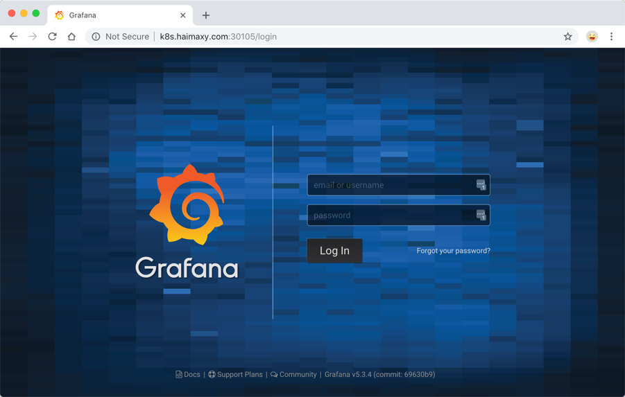

由于上面我们配置了管理员的，所以第一次打开的时候会跳转到登录界面，然后就可以用上面我们配置的两个环境变量的值来进行登录了，登录完成后就可以进入到下面 Grafana 的首页：
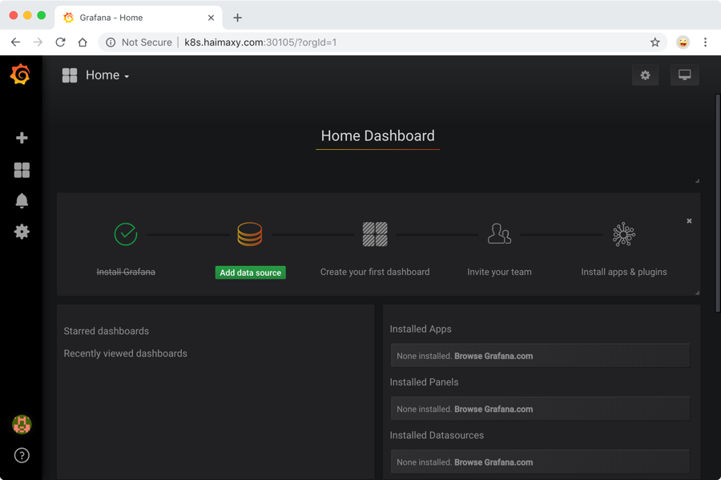


## 配置
在上面的首页中我们可以看到已经安装了 Grafana，接下来点击`Add data source`进入添加数据源界面。

### 数据源
我们这个地方配置的数据源是 Prometheus，所以选择这个 Type 即可，给改数据源添加一个 name：prometheus-ds，最主要的是下面`HTTP`区域是配置数据源的访问模式。

访问模式是用来控制如何处理对数据源的请求的：

* 服务器(Server)访问模式（默认）：所有请求都将从浏览器发送到 Grafana 后端的服务器，后者又将请求转发到数据源，通过这种方式可以避免一些跨域问题，其实就是在 Grafana 后端做了一次转发，需要从Grafana 后端服务器访问该 URL。
* 浏览器(Browser)访问模式：所有请求都将从浏览器直接发送到数据源，但是有可能会有一些跨域的限制，使用此访问模式，需要从浏览器直接访问该 URL。

由于我们这个地方 Prometheus 通过 NodePort 的方式的对外暴露的服务，所以我们这个地方是不是可以使用浏览器访问模式直接访问 Prometheus 的外网地址，但是这种方式显然不是最好的，相当于走的是外网，而我们这里 Prometheus 和 Grafana 都处于 kube-ops 这同一个 namespace 下面，是不是在集群内部直接通过 DNS 的形式就可以访问了，而且还都是走的内网流量，所以我们这里用服务器访问模式显然更好，数据源地址：`http://prometheus:9090`（因为在同一个 namespace 下面所以直接用 Service 名也可以），然后其他的配置信息就根据实际情况了，比如 Auth 认证，我们这里没有，所以跳过即可，点击最下方的`Save & Test`提示成功证明我们的数据源配置正确：

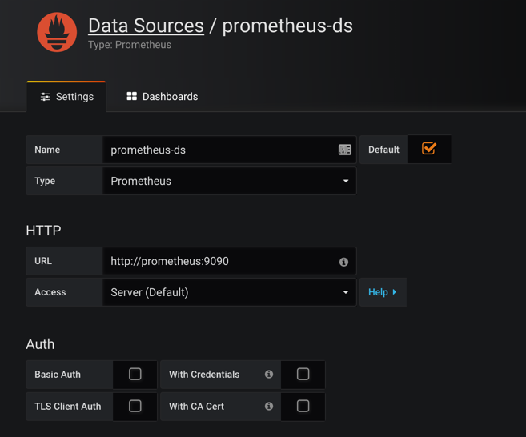

数据源添加完成后，就可以来添加 Dashboard 了。

### Dashboard
同样，切换到主页，我们可以根据自己的需求手动新建一个 Dashboard，除此之外，grafana 的官方网站上还有很多公共的 Dashboard 可以供我们使用，我们这里可以使用[Kubernetes cluster monitoring (via Prometheus)(dashboard id 为162)](https://grafana.com/dashboards/162/revisions)这个 Dashboard 来展示 Kubernetes 集群的监控信息，在左侧侧边栏 Create 中点击`import`导入：
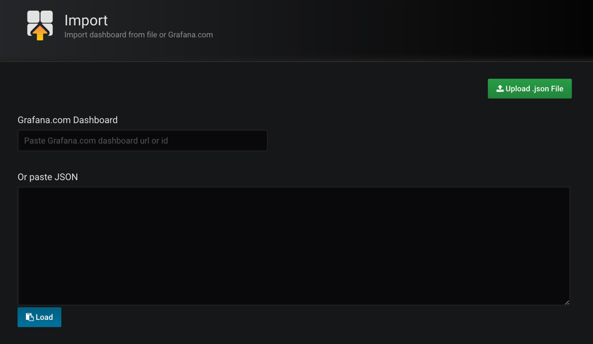

我们可以将上面编号`162`的 dashboard 下载到本地，然后这里重新上传即可，也可以在上面的文本框中直接输入`162`编号回车即可，导入这个 dashboard：
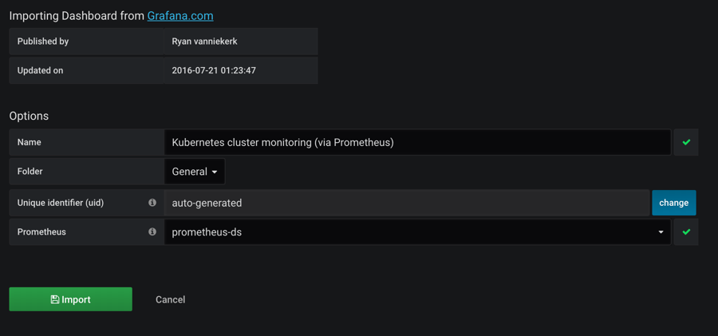

需要注意的是在执行上面的 import 之前要记得选择我们的`prometheus-ds`这个名字的数据源，执行`import`操作，就可以进入到 dashboard 页面：
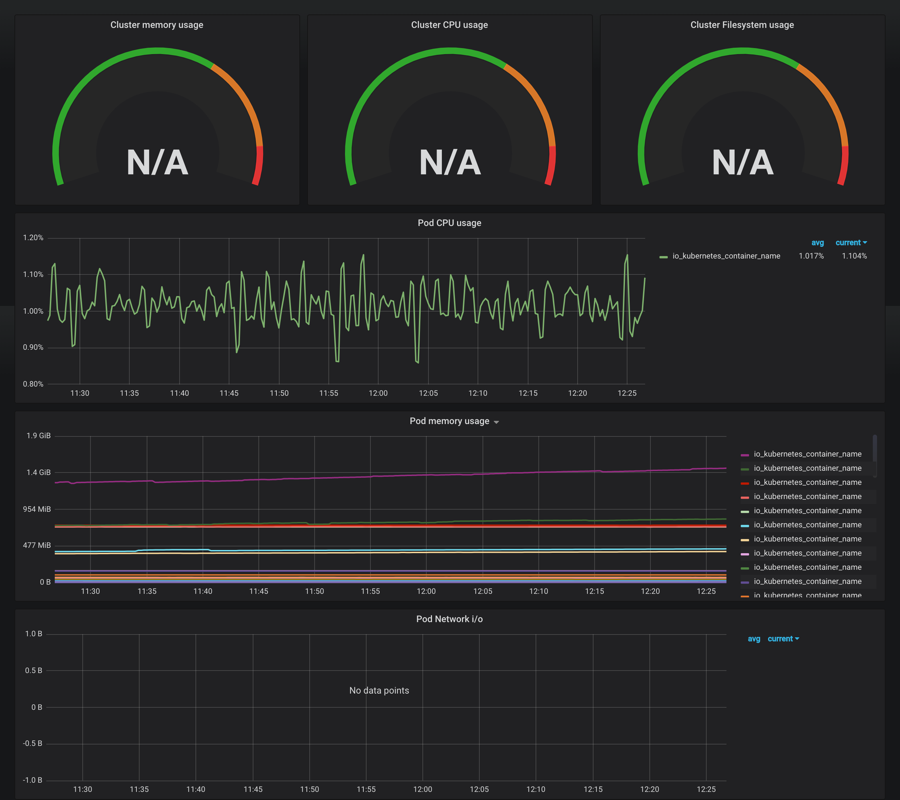

我们可以看到 dashboard 页面上出现了很多漂亮的图表，但是看上去数据不正常，这是因为这个 dashboard 里面需要的数据指标名称和我们 Prometheus 里面采集到的数据指标不一致造成的，比如，第一个`Cluster memory usage(集群内存使用情况)`，我们可以点击标题 -> Edit，进入编辑这个图表的编辑页面：
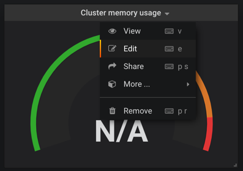

进入编辑页面我们就可以看到这个图表的查询语句：
```
(sum(node_memory_MemTotal) - sum(node_memory_MemFree+node_memory_Buffers+node_memory_Cached) ) / sum(node_memory_MemTotal) * 100
```

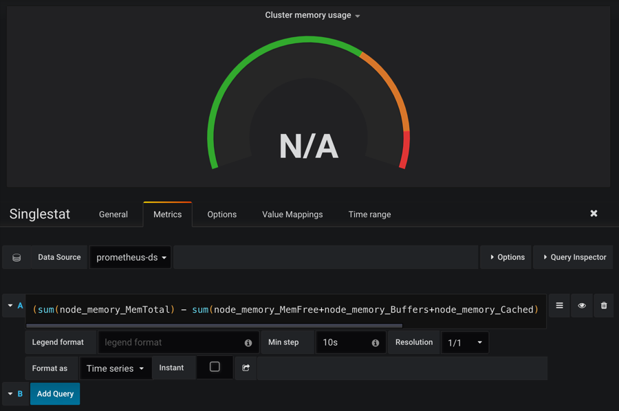

这就是我们之前在 Prometheus 里面查询的`promQL`语句，我们可以将上面的查询语句复制到 Prometheus 的 Graph 页面进行查询，其实可以预想到是没有对应的数据的，因为我们用`node_exporter`采集到的数据指标不是`node_memory_MemTotal`关键字，而是`node_memory_MemTotal_bytes`，将上面的`promQL`语句做相应的更改：
```
(sum(node_memory_MemTotal_bytes) - sum(node_memory_MemFree_bytes + node_memory_Buffers_bytes+node_memory_Cached_bytes)) / sum(node_memory_MemTotal_bytes) * 100
```

这个语句的意思就是`(整个集群的内存-(整个集群剩余的内存以及Buffer和Cached))/整个集群的内存`，简单来说就是总的集群内存使用百分比。将上面 grafana 的`promQL`语句替换掉，就可以看到图表正常了：
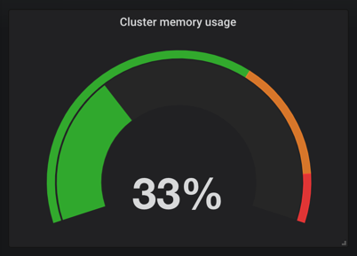


同样的，我们可以更改后面的 CPU 和 FileSystem 的使用率：


同样下面的`Pod CPU Usage`用来展示 Pod CPU 的使用情况，对应的`promQL`语句如下，根据 pod_name 来进行统计：
```
sum by (pod_name)(rate(container_cpu_usage_seconds_total{image!="", pod_name!=""}[1m]))
```

按照上面的方法替换 grafana 中的 dashboard 图表中的查询语句：


其他的也按照我们的实际需求重新编辑下就可以，下图是最终整个 dashboard 的效果图：
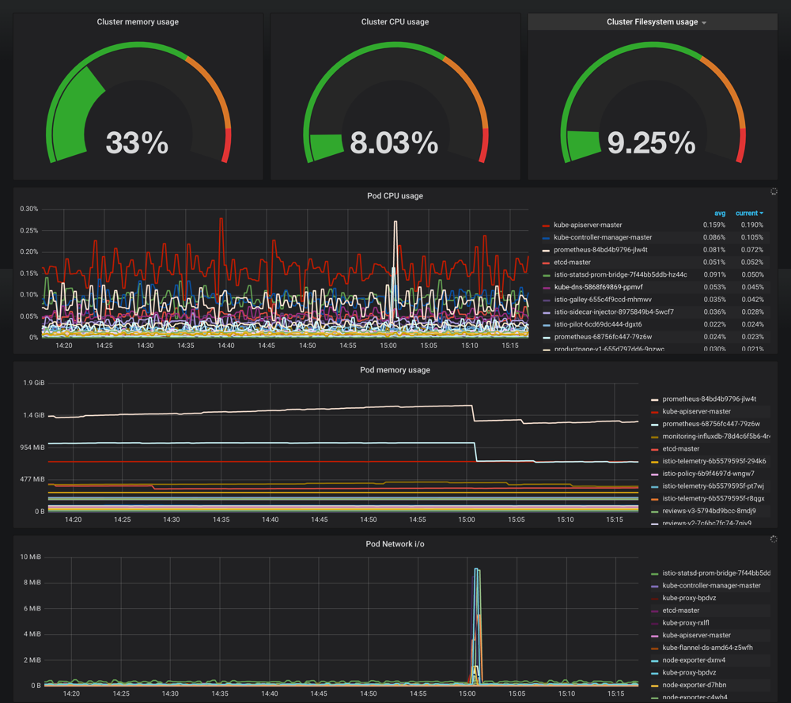


最后要记得保存这个 dashboard，下面的链接是我修改后的 dashboard json 文件地址，你可以直接下载下来导入到 grafana 当中，当然你也可以根据实际情况进行相应的更改：[k8s-cluster-grafana-dashboard.json](./files/grafana-k8s-cluster-dashboard.json)。


除此之外，我们也可以前往 grafana dashboard 的页面去搜索其他的关于 Kubernetes 的监控页面，地址：[https://grafana.com/dashboards](https://grafana.com/dashboards)，比如id 为747和741的这两个 dashboard。

## 插件
上面是我们最常用的 grafana 当中的 dashboard 的功能的使用，然后我们也可以来进行一些其他的系统管理，比如添加用户，为用户添加权限等等，我们也可以安装一些其他插件，比如 grafana 就有一个专门针对 Kubernetes 集群监控的插件：[grafana-kubernetes-app](https://grafana.com/plugins/grafana-kubernetes-app/installation)

要安装这个插件，需要到 grafana 的 Pod 里面去执行安装命令：
```shell
$ kubectl get pods -n kube-ops
NAME                          READY     STATUS      RESTARTS   AGE
grafana-79477fbb7c-v4prs      1/1       Running     0          23m
$ kubectl exec -it grafana-79477fbb7c-v4prs /bin/bash -n kube-ops
grafana@grafana-79477fbb7c-v4prs:/usr/share/grafana$ grafana-cli plugins install grafana-kubernetes-app
installing grafana-kubernetes-app @ 1.0.1
from url: https://grafana.com/api/plugins/grafana-kubernetes-app/versions/1.0.1/download
into: /var/lib/grafana/plugins

✔ Installed grafana-kubernetes-app successfully

Restart grafana after installing plugins . <service grafana-server restart>

grafana@grafana-79477fbb7c-v4prs:/usr/share/grafana$
```

安装完成后需要重启 grafana 才会生效，我们这里直接删除 Pod，重建即可，然后回到 grafana 页面中，切换到 plugins 页面可以发现下面多了一个 Kubernetes 的插件，点击进来启用即可，然后点击`Next up`旁边的链接配置集群
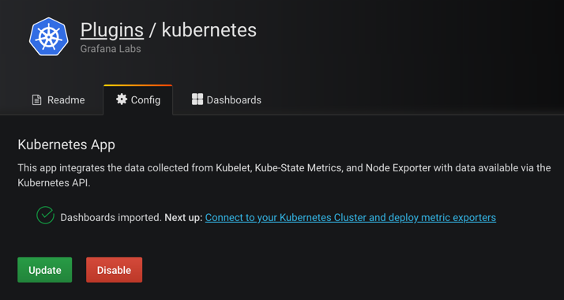


这里我们可以添加一个新的 Kubernetes 集群，这里需要填写集群的访问地址：`https://kubernetes.default`，然后比较重要的是集群访问的证书，勾选上`TLS Client Auth`和`With CA Cert`这两项。
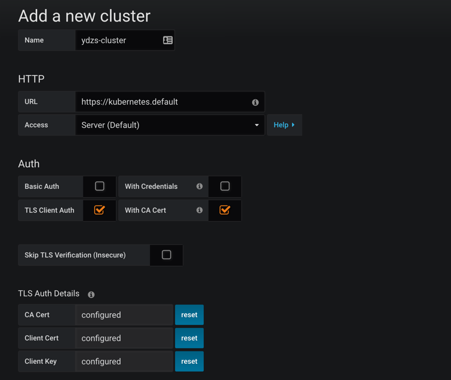


集群访问的证书文件，用我们访问集群的 kubectl 的配置文件中的证书信息(~/.kube/config)即可，其中属性`certificate-authority-data`、`client-certificate-data`、`client-key-data`就对应这 CA 证书、Client 证书、Client 私钥，不过 config 文件里面的内容是`base64`编码过后的，所以我们这里填写的时候要做`base64`解码。

> 另外需要将解码过后的`\n`换成换行符，不然认证会失败。

配置完成后，可以直接点击`Deploy`(实际上前面的课程中我们都已经部署过相关的资源了)，然后点击`Save`，就可以获取到集群的监控资源信息了。

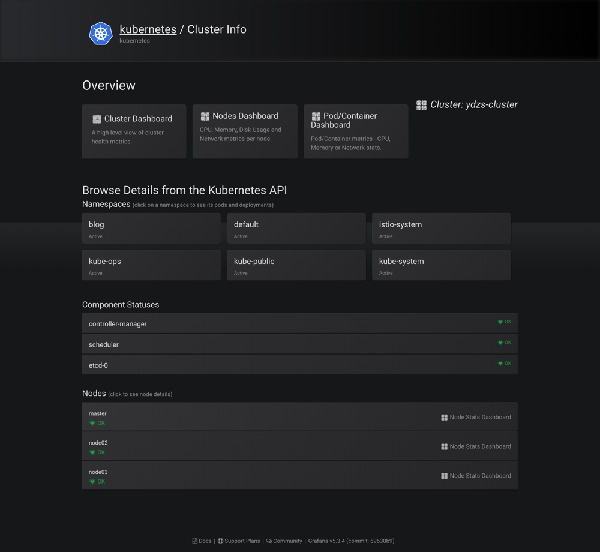

可以看到上面展示了整个集群的状态，可以查看上面的一些 Dashboard:
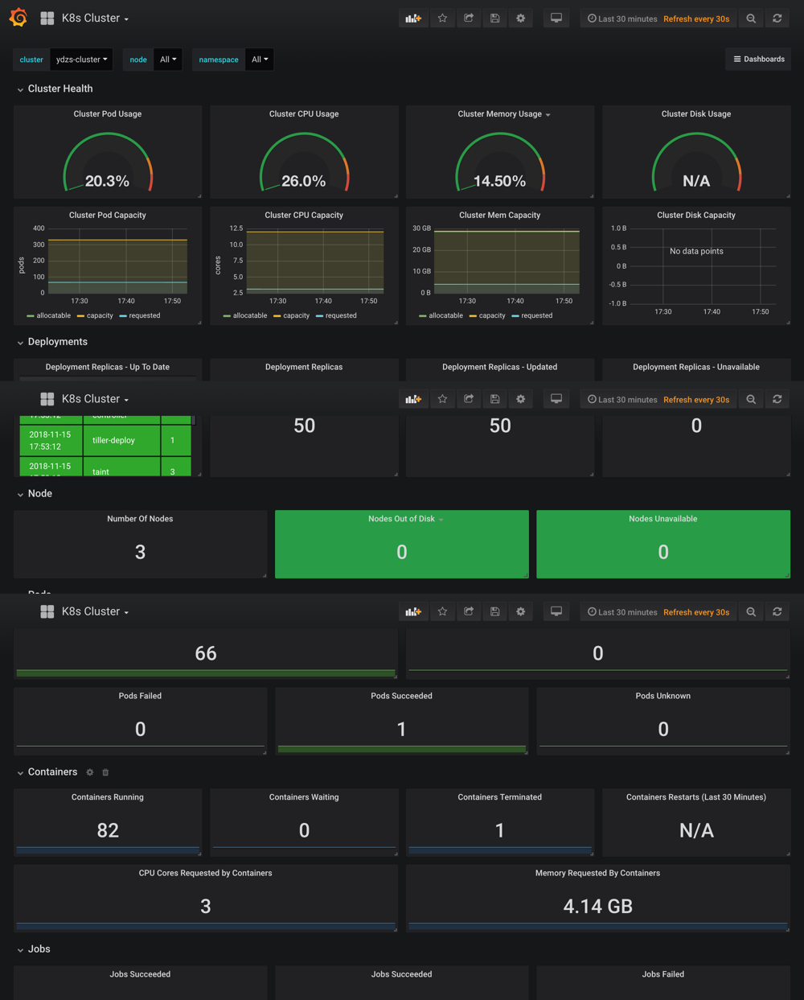


 ## 报警
 grafana 4 版本以上就支持了报警功能，这使得我们利用 grafana 作为监控面板更为完整，因为报警是监控系统中必不可少的环节，grafana 支持很多种形式的报警功能，比如 email、钉钉、slack、webhook 等等，我们这里来测试下 email 和 钉钉。

 ### email 报警
 要启用 email 报警需要在启动配置文件中`/etc/grafana/grafan.ini`开启 SMTP 服务，我们这里同样利用一个 ConfigMap 资源对象挂载到 grafana Pod 中：（grafana-cm.yaml）
```yaml
apiVersion: v1
kind: ConfigMap
metadata:
  name: grafana-config
  namespace: kube-ops
data:
  grafana.ini: |
    [server]
    root_url = http://<你grafana的url地址>
    [smtp]
    enabled = true
    host = smtp.163.com:25
    user = ych_1024@163.com
    password = <邮箱密码>
    skip_verify = true
    from_address = ych_1024@163.com
    [alerting]
    enabled = true
    execute_alerts = true
```

上面配置了我的 163 邮箱，开启报警功能，当然我们还得将这个 ConfigMap 文件挂载到 Pod 中去：
```yaml
  volumeMounts:
  - mountPath: "/etc/grafana"
    name: config
volumes:
- name: config
  configMap:
    name: grafana-config
```

创建 ConfigMap 对象，更新 Deployment：
```shell
$ kubectl create -f grafana-cm.yaml
$ kubectl apply -f grafana-deploy.yaml
```

更新完成后，在 grafana 的 webui 中`Alert`页面测试邮件报警：

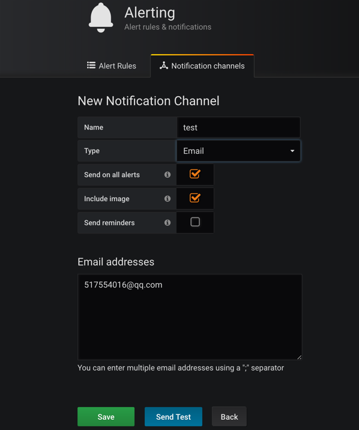


发送测试后，正常情况下就可以收到测试报警邮件：

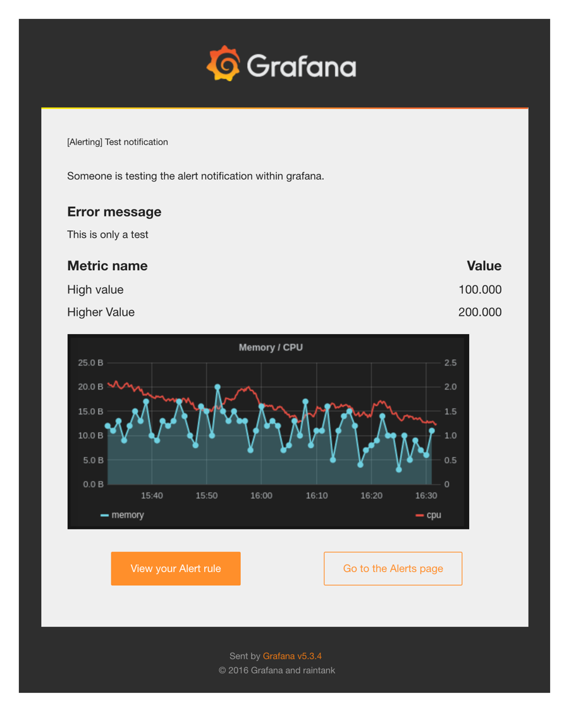


### 钉钉报警
上面我们也说了 grafana 也是支持钉钉报警的，在钉钉群里面添加群机器人，选择最后的自定义机器人：

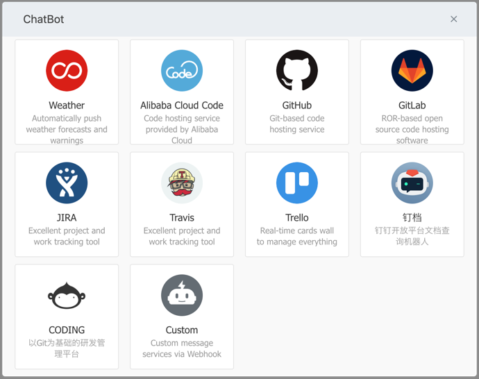

添加完成后可以得到一个 webhook 的地址，然后将这个 webhook 地址添加到上面 grafana webui 的报警测试页面进行测试，就可以在钉钉群里面收到报警测试信息了：

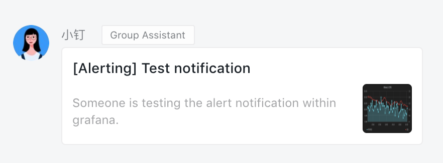

 ### 配置
目前只有 Graph 支持报警功能，所以我们选择 Graph 相关图表，点击编辑，进入 Graph 编辑页面可以看到有一个 Alert 模块，切换过来创建报警：

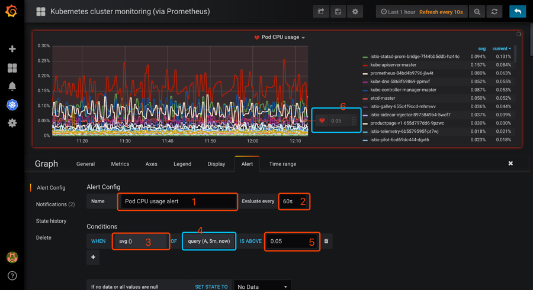

然后配置相关参数：
* 1、Alert 名称，可以自定义。
* 2、执行的频率，这里我选择每60s检测一次。
* 3、判断标准，默认是 avg，这里是下拉框，自己按需求选择。
* 4、query（A,5m,now），字母A代表选择的metrics 中设置的 sql，也可以选择其它在 metrics中设置的，但这里是单选。`5m`代表从现在起往之前的五分钟，即`5m`之前的那个点为时间的起始点，`now`为时间的结束点，此外这里可以自己手动输入时间。
* 5、设置的预警临界点，这里手动输入，和6是同样功能，6可以手动移动，两种操作是等同的。

然后需要设置报警发送信息，点击侧边的`Notifications`:


其中`Send to`就是前面我们配置过的发送邮件和钉钉的报警频道的名称。

配置完成后需要保存下这个 graph，否则发送报警可能会失败，然后点击 Alert 区域的`Test Rule`可以来测试报警规则，然后邮件和钉钉正常来说就可以收到报警信息了。

邮件报警信息：

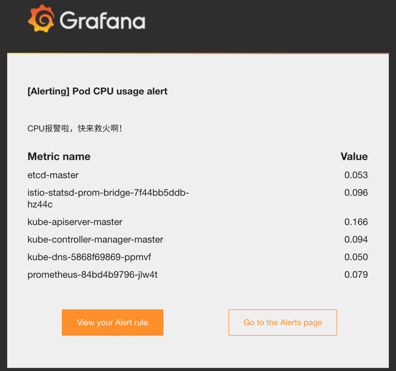

钉钉报警信息：


到这里就完成了使用 grafana 来展示 Kubernetes 集群的监控图表信息以及报警配置，但是我们明显可以感觉到 grafana 的优势在于图表的展示，报警功能有点弱，所以一般来说，在生产环境我们不会直接使用 grafana 的报警功能，更多的是使用功能更加强大的 `AlertManager`，下节课我们再来和大家介绍了。


---
[点击查看本文视频](https://youdianzhishi.com/course/6n8xd6/)

扫描下面的二维码(或微信搜索`k8s技术圈`)关注我们的微信公众帐号，在微信公众帐号中回复 **加群** 即可加入到我们的 kubernetes 讨论群里面共同学习。


